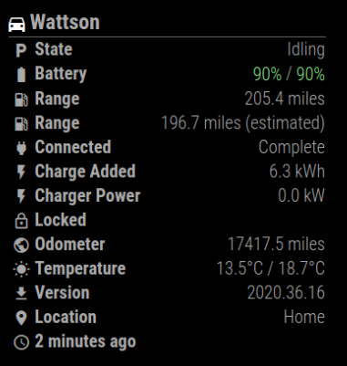

# MMM-Tesla

This an extension for the [MagicMirror](https://github.com/MichMich/MagicMirror).

With this module, you can display the status of your Tesla vehicle from [TeslaFi](https://www.teslafi.com/signup.php?referred=warlrus) or [Tessie](https://tessie.com/). Many different pieces of data can be shown, such as the battery level, temperature, lock status and plenty more!

This is a partial re-write of the original MMM-TeslaFi by [f00d4tehg0dz](https://github.com/f00d4tehg0dz), which can be found [here](https://github.com/f00d4tehg0dz/MMM-TeslaFi). I have chosen to not merge this version back in as it breaks some functionality of the original module.

I am happy to accept any [bug reports](https://github.com/mattdy/MMM-Tesla/issues) or [pull requests](https://github.com/mattdy/MMM-Tesla/pulls) for new features or fixes.

## Screenshot



## Installation

Open a terminal session, navigate to your MagicMirror's `modules` folder and execute the following commands:

```console
$ git clone https://github.com/mattdy/MMM-Tesla.git
$ cd MMM-Tesla
$ npm install
```

Alternatively, you can install automatically using the excellent [Magic Mirror Package Manager](https://github.com/Bee-Mar/mmpm)

```console
$ mmpm -i MMM-Tesla
```

Once installed, you should then activate the module by adding it to the config.js file as shown here:

```javascript
modules: [
  {
    module: "MMM-Tesla",
    position: "top_left",
    config: {
      source: {
        name: "teslafi",
        apiKey: "ENTER YOUR KEY HERE"
      }
    }
  }
];
```

You can then use the various configuration options below to customise how the module is displayed. By default, all fields will be shown. You can set the `items` configuration option to an array of field names as shown in
[Available fields](#available-fields) to limit the number of data items shown.

## Config Options

| Option          | Details                                                                                                               | Example                                             |
| --------------- | --------------------------------------------------------------------------------------------------------------------- | --------------------------------------------------- |
| source          | **Required** - The source from which to pull Tesla data. See [Data Source](#data-source) below for more information   | [See below](#data-source)                           |
| refreshInterval | The time interval (in milliseconds) at which the module contents will be updated locally                              | `1000 * 60`                                         |
| updateInterval  | The time interval (in milliseconds) at which fresh data will be gathered from your chosen source                      | `1000 * 60 * 5`                                     |
| batteryDanger   | The percentage below which your battery level will highlight in red                                                   | `40`                                                |
| batteryWarning  | The percentage below which your battery level will highlight in orange                                                | `60`                                                |
| precision       | How many decimal places to round values (such as mileage and energy) to. Defaults to 1                                | `2`                                                 |
| unitTemperature | The unit to use for displaying temperature. Options are 'f' (Farenheight) or 'c' (Celcius). Defaults to 'c'           | `f`                                                 |
| unitDistance    | The unit to use for displaying distance. Options are 'miles' or 'km'. Defaults to 'miles'                             | `km`                                                |
| items           | The rows of data you want the module to show. See list [below](#available-fields). By default will show all available | `['battery','range-estimated','locked','odometer']` |
| dataTimeout     | How old data must be in seconds before 'data-time' is displayed. Use 0 to always show                                 | `0`                                                 |

### Data Source

The `source` configuration option defines which data source you want to use to pull Tesla data from. At the moment there are two available options, which are configured as shown below. Note that some data fields may not be available from some data sources due to API differences.

#### TeslaFi

You should obtain your API key from [TeslaFi.com](https://teslafi.com/api.php) and configure the module as follows:

```javascript
modules: [
  {
    module: "MMM-Tesla",
    position: "top_left",
    config: {
      source: {
        name: "teslafi",
        apiKey: "ENTER YOUR KEY HERE",
        apiCommand: "lastGoodTemp"
      }
    }
  }
];
```

The `apiCommand` configuration variable is optional, see [TeslaFi](https://teslafi.com/api.php) for possible values.

#### Tessie

You should obtain your access token from [Tessie.com](https://my.tessie.com/settings/api), as well as the VIN code of the vehicle you wish to display, and configure the module as follows

```javascript
modules: [
  {
    module: "MMM-Tesla",
    position: "top_left",
    config: {
      source: {
        name: "tessie",
        apiKey: "ENTER YOUR ACCESS TOKEN HERE",
        vin: "ENTER YOUR VIN HERE"
      }
    }
  }
];
```

### Maps Configuration

The `maps` configuration option takes the following sub-options, which allow you to configure a static Google Maps display of the vehicles current location.
See [Map section](#map) below for more information

| Option           | Details                                                                                                | Example                                    |
| ---------------- | ------------------------------------------------------------------------------------------------------ | ------------------------------------------ |
| maps.apiKey      | Google Maps API key. Must have "Static Maps API" access enabled. See [Map](#map) below for more detail | `AIzaSyB6KgHKwRNa63JsVHuu7d8jV-1IH875idKs` |
| maps.zoom        | [Zoom level](https://developers.google.com/maps/documentation/maps-static/start#Zoomlevels) of map     | `13`                                       |
| maps.width       | Specify width of map                                                                                   | `300`                                      |
| maps.height      | Specify height of map                                                                                  | `150`                                      |
| maps.exclude     | Specify TeslaFi tagged locations at which the map field will not be shown. Case insensitive.           | `[ 'home', 'Work', 'cottage' ]`            |
| maps.drivingOnly | Only display the map when the car is driving                                                           | `true`                                     |

## Available fields

| Field name             | Data display                                                                                                                     |
| ---------------------- | -------------------------------------------------------------------------------------------------------------------------------- |
| battery                | Shows the current charge level (percent) and the charge limit                                                                    |
| range                  | The range (in miles) that the vehicle has available                                                                              |
| range&#x2011;estimated | The estimated range (in miles) that the vehicle has available                                                                    |
| power&#x2011;connected | Whether or not the vehicle is connected to a charger. If so, also displays the charge state                                      |
| charge&#x2011;time     | How long left until the charge is complete                                                                                       |
| charge&#x2011;added    | How much energy has been added on this charge session                                                                            |
| charge&#x2011;power    | How much energy the vehicle is currently receiving                                                                               |
| locked                 | Whether or not the vehicle is locked                                                                                             |
| odometer               | Total mileage of the vehicle (rounded to 2 decimal places)                                                                       |
| temperature            | Temperature outside and inside the vehicle (see note below)                                                                      |
| data&#x2011;time       | How long ago the data was collected                                                                                              |
| location               | Displays the current location as tagged in TeslaFi. Not shown if the vehicle is driving, or if the current location isn't tagged |
| version                | Current version installed                                                                                                        |
| version&#x2011;new     | Display new version if available - hidden if no new version is available                                                         |
| state                  | Vehicle State (Idling/Driving/Sentry)                                                                                            |
| speed                  | Vehicle speed in preferred units                                                                                                 |
| heading                | Vehicle heading                                                                                                                  |
| map                    | Displays current location on a map. See the [Map section](#map) for details on how to configure                                  |

- Some fields may not work with certain data sources. For example - location, version and version-new will only work with TeslaFi
- Some fields (charge-time, charge-added, charge-power) are only enabled if the vehicle is plugged in
- Some fields (version, speed, heading) are only enabled if the vehicle is (or is not) driving
- The temperature field may not be populated if you use TeslaFi's sleep mode, which will stop this row from showing entirely. You may need to use `apiCommand: "lastGoodTemp"` if this fails to show
- For details on TeslaFi's 'location' tags, see [TeslaFi Locations](https://teslafi.com/locations.php)

## Map

In order to enable the `map` field, you must first have created a Google Maps API key from the [Google Maps Developer Platform](https://developers.google.com/maps/documentation/maps-static/overview). This is easy to do, and comes
with ~100,000 free calls per month. Once you have created the API key, you must enable the "Maps Static API". Once you have done this, add the API key to your configuration and add the `map` field to your list of items.
This will show a non-interactive map of the vehicles location. The size of this map can be configured with the `maps` configuration options, as in the example below. Note that you will not be able to zoom or move the map with touch/mouse functionality.

```
modules: [
  {
    module: "MMM-Tesla",
    position: "top_left",
    config: {
      source: {
        name: "teslafi",
        apiKey: "ENTER YOUR KEY HERE"
      }
      maps: {
        apiKey: "ENTER YOUR GOOGLE MAPS KEY HERE",
        zoom: 12,
        width: 300,
        height: 300,
        drivingOnly: true
      }
    }
  }
];
```

## Contributing

If you have an idea for an additional field, then please raise an [issue](https://github.com/mattdy/MMM-Tesla/issues) with the `enhancement` label. Alternatively, please feel free to develop the new functionality yourself and submit a
[pull request](https://github.com/mattdy/MMM-Tesla/pulls) - I'd be delighted to incorporate any new fields.

In order to keep the code as accessible as possible, there are Github Actions defined to run `eslint` (JS & CSS) and `prettier` checks against all Pull Requests. Additionally, `prettier` is automatically run on merges to the `master` branch.

Finally, if you find this module useful and would like to make a small contribution to the primary developer ([mattdy](https://github.com/mattdy)) then you can do so at [this link](http://paypal.me/mattdy90).
Alternatively, please consider using my [TeslaFi referral link](https://www.teslafi.com/signup.php?referred=warlrus) if this module has inspired you to subscribe, or my [Tesla referral link](http://ts.la/matthew6411) if this module
has inspired you to buy a Tesla!

## Credits

- Thanks to [Justyn](https://github.com/justynr) for creating the location, version, state, speed, heading & map fields
- Thanks to [Adrian](https://github.com/f00d4tehg0dz) for the [original version](https://github.com/f00d4tehg0dz/MMM-TeslaFi)
- Big thanks to [aduyng](https://github.com/aduyng) for their [TeslaStatus](https://github.com/aduyng/MMM-TeslaStatus) module used as a template!
