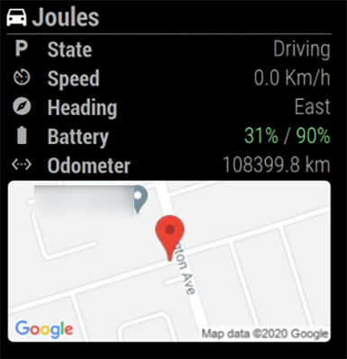

# MMM-TeslaFi

This an extension for the [MagicMirror](https://github.com/MichMich/MagicMirror).

It monitors a your Tesla Stats, such as Battery Level, Temperature, Lock status and much more! A valid API key is required, the key can be requested here: <https://teslafi.com>

This is a partial re-write of the original MMM-TeslaFi by [f00d4tehg0dz](https://github.com/f00d4tehg0dz), which can be found [here](https://github.com/f00d4tehg0dz/MMM-TeslaFi). I have chosen to not merge this version back in as it breaks some functionality of the original module.

I am happy to accept any [bug reports](https://github.com/mattdy/MMM-TeslaFi/issues) or [pull requests](https://github.com/mattdy/MMM-TeslaFi/pulls) for new features or fixes.

## Screenshot


- 'battery'
- 'range'
- 'range-estimated
- 'power-connected'
- 'charge-time'
- 'charge-added'
- 'locked'
- 'odometer'
- 'temperature'
- 'data-time'


- 'state' (automatically includes Speed and Heading when vehicle is driving)
- 'battery'
- 'odometer'
- 'map'


- 'state'
- 'battery'
- 'odometer'
- 'version' 
- 'distance'
- 'duration' 
- 'location'

## Installation

Open a terminal session, navigate to your MagicMirror's `modules` folder and execute `git clone https://github.com/mattdy/MMM-TeslaFi.git`, a new folder called MMM-TeslaFi will be created.

Activate the module by adding it to the config.js file as shown below. Of course the position is up to you.

## Notes

### Config Options

| Option | Details | Example |
| --- | --- | --- |
| apiKey | **Required** - The API key from [TeslaFi.com](https://teslafi.com/api.php) | `4de3736a68714869d3e2fbda1f1b83ff` |
| batteryDanger | The percentage at which your battery level will highlight in red | `40` |
| batteryWarning | The percentage at which your battery level will highlight in orange | `60` |
| precision | How many decimal places to round values (such as mileage and energy) to. Defaults to 1 | `2` |
| apiBase | The URL to use for the TeslaFi API | `https://www.teslafi.com/feed.php?token=` |
| apiQuery | Extra parameters to add on to the end of the TeslaFi API call | `&command=lastGoodTemp` |
| unitTemperature | The unit to use for displaying temperature. Options are 'f' (Farenheight) or 'c' (Celcius). Defaults to 'c' | `f` |
| unitDistance | The unit to use for displaying distance. Options are 'miles' or 'km'. Defaults to 'miles' | `km` |
| items | The rows of data you want the module to show. See list below. By default will show all available | `['battery','range-estimated','locked','odometer']` |
| initialLoadDelay | How many seconds to delay initial API call |
| dataTimeout | How old data must be in seconds before 'data-time' is displayed. Use 0 to always show | `0` |
| googleMapApiKey | Google Maps "Static Maps API" | `AIzaSyB6KgHKwRNa63JsVHuu7d8jV-1IH875idKs` |
| mapZoom | (optional) Zoom Level of map | 13 |
| mapWidth | (optional) Specify width of map | 300 |
| mapHeight | (optional) Specify height of map | 150 |
| excludeLocations | (optional) Specify locations to hide map by TeslaFi Location Tags (case insensitive) - stops Google Map generation @ listed locations | `[ 'home', 'Work', 'cottage' ]` |
| homeAddress | Specify home address for 'distance' and 'duration' values - calculates vehichle's best route and displays distance and duration of drive to this address (if vehicle is at an 'excludedLocation', this is not used!) | `123 Fake St. Toronto ON Canada` |

### Available fields

| Field name | Data display |
| --- | --- |
| battery | Shows the current charge level (percent) and the charge limit |
| range | The range (in miles) that the vehicle has available |
| range-estimated | The estimated range (in miles) that the vehicle has available |
| power-connected | Whether or not the vehicle is connected to a charger. If so, also displays the charge state |
| charge-time | How long left until the charge is complete |
| charge-added | How much energy has been added on this charge session |
| charge-power | How much energy the vehicle is currently receiving |
| locked | Whether or not the vehicle is locked - only appears if vehicle is not driving |
| odometer | Total mileage of the vehicle (rounded to 2 decimal places) |
| temperature | Temperature outside and inside the vehicle (see note below) |
| data-time | How long ago the data was collected by TeslaFi |
| state | Vehicle State (Idling/Driving/Sentry) (see note below) |
| version | Current version installed - changes to display new version if available |
| newVersion | Display new version if available - hidden if not available |
| location | Displays current location as tagged in TeslaFi - Is hidden if driving or vehicle's location is not tagged |
| map | Displays current location on a map - Dims if not 'Driving' |
| distance | Displays current distance (as driving route) vehichle is from 'homeAddress' |
| duration | Displays time to drive from vehicle's current location to 'homeAddress' - Google's best guess - based on current traffic|

* Some fields (charge-time, charge-added) are only enabled if the vehicle is plugged in
* State field will display vehicle's speed (in preferred units) and vehicle's heading when the state is "Driving"
* The temperature field may not be populated if you use TeslaFi's sleep mode, which will stop this row from showing entirely. You may need to use `apiQuery: "&command=lastGoodTemp"` if this fails to show

* To get Google Maps API Key, start here: [Google Maps Developer Platform](https://developers.google.com/maps/documentation/maps-static/overview?utm_source=google&utm_medium=cpc&utm_campaign=FY18-Q2-global-demandgen-paidsearchonnetworkhouseads-cs-maps_contactsal_saf&utm_content=text-ad-none-none-DEV_c-CRE_432494864760-ADGP_Hybrid%20%7C%20AW%20SEM%20%7C%20SKWS%20~%20Maps%20Static%20API-KWID_43700053359877717-kwd-505086761433-userloc_9000983&utm_term=KW_%2Bmaps%20%2Bstatic%20%2Bapi-ST_%2Bmaps%20%2Bstatic%20%2Bapi&gclid=EAIaIQobChMImdKugZjJ7AIViInICh2BFAjGEAAYASAAEgJSB_D_BwE) It's easy and comes with ~100,000 free calls/month.
  * For the static map, activate the "Maps Static API" (note: the map is static and not interactive - it is essentially a picture and will not zoom/scroll with touch interactivity)
  * For the "distance" and/or "duration" field, activate the "Distance Matrix API"
    * both of these APIs use the same API key.

## Credits

* Thanks to [Adrian](https://github.com/f00d4tehg0dz) for the [original version](https://github.com/f00d4tehg0dz/MMM-TeslaFi)
* Big thanks to [aduyng](https://github.com/aduyng) for their [TeslaStatus](https://github.com/aduyng/MMM-TeslaStatus) module used as a template!
* [Justynr](https://github.com/justynr)

## Using the module

````javascript
modules: [
  {
   module:  'MMM-TeslaFi',
   position: 'top_left',
   config: {
    apiKey: 'ENTER YOUR KEY HERE',
   }
  },
]
````
